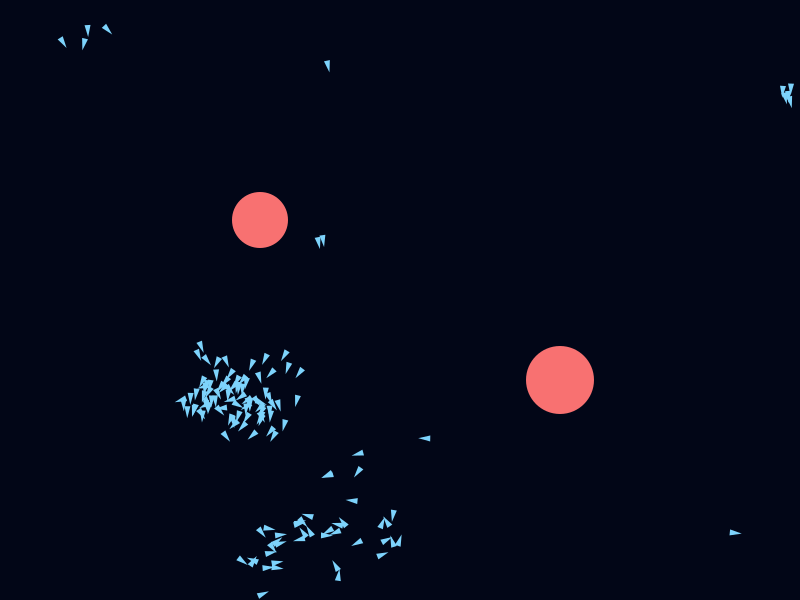

# Murmur

*Watch three simple rules become a living flock.*

[](https://github.com/ctkrug/boids-playground/actions/workflows/ci.yml)
[](LICENSE)


Murmur is an interactive boids flocking simulation that runs entirely in your browser on a plain
HTML5 Canvas: no frameworks, no build step, no dependencies. Drag the separation, alignment, and
cohesion sliders and watch hundreds of agents reorganize themselves into flocks, streams, and
swirling vortices in real time.

**▶ [Play it live](https://apps.charliekrug.com/boids-playground/)**



<sub>An actual frame rendered by the simulation. See [`scripts/render-sample.js`](scripts/render-sample.js).</sub>

## Why

Craig Reynolds' 1986 "boids" model is one of the cleanest demonstrations of emergent behavior in
computer science: three simple local rules, applied to every agent independently, produce flocking
that looks deliberate and alive. Most boids demos online are static screenshots, locked-down toys
with no controls, or buried inside a game-engine project. Murmur is a single page you open, drag
some sliders, and immediately see cause and effect, and the whole simulation is small enough to
read end to end in one sitting.

## Features

- Classic three-rule flocking: separation, alignment, cohesion, each independently weighted.
- Live tunable parameters (sliders): perception radius, max speed, max force, per-rule weights,
  flock size.
- Mouse/touch interaction: attract, repel, or drop obstacles the flock must steer around.
- Toroidal (wrap-around) and bounded (steer-away) world modes.
- Spatial partitioning (grid) for neighbor queries so the simulation stays smooth at high
  flock counts (300+ boids).
- Visual debug overlay: optional rendering of each boid's perception radius and velocity vector.
- Preset configurations ("tight schooling fish", "loose starlings", "chaotic swarm").
- Pause/step/reset controls and an FPS readout.

## Stack

- Plain JavaScript (ES modules) and the Canvas 2D API, zero runtime dependencies.
- Vanilla HTML/CSS for the control panel.
- [Vitest](https://vitest.dev/) for unit tests of the vector math and flocking rules.
- [ESLint](https://eslint.org/) for linting.
- Deployed as a static site (GitHub Pages or any static host); no server and no build step required
  to run it.

## Status

All planned v1 functionality is implemented. See [`docs/VISION.md`](docs/VISION.md) for the design
and [`docs/BACKLOG.md`](docs/BACKLOG.md) for the story-by-story build order.

## Running locally

`main.js` is loaded as an ES module, which browsers refuse to fetch over `file://` (a CORS
restriction), so opening `src/index.html` directly won't work. Serve the repo root with any
static file server instead:

```sh
npx serve .
```

Then open the printed URL and navigate to `src/index.html`. If you don't have Node's `npx`
handy, any static file server works just as well, for example Python's built-in one:

```sh
python3 -m http.server 8000
```

## Using the control panel

- **Presets:** pick a named configuration ("tight schooling fish", "loose starlings", "chaotic
  swarm") to set every rule slider at once; you can keep tweaking from there.
- **Rules:** perception radius, max speed, max force, and the separation/alignment/cohesion
  weights are all live sliders; changes apply on the next simulation frame.
- **Flock:** the flock-size slider grows or shrinks the population without resetting existing
  boids, and "Wrap around edges" toggles between toroidal and bounded world modes.
- **Pointer:** hover (or touch) the canvas to attract or repel the flock toward the cursor;
  switch modes (or turn it off) from the dropdown, and tune the pull/push strength with the
  pointer-strength slider.
- **Display:** "Show debug overlay" renders each boid's perception radius and velocity vector,
  useful for seeing exactly what each rule is reacting to.
- **Obstacles:** click (or tap) anywhere on the canvas to drop a static obstacle the flock
  steers around; the avoidance-strength slider controls how hard boids push away from them, and
  "Clear obstacles" removes them all. The obstacle count is shown alongside fps and boid count.
- **Playback:** Pause/Resume stops and restarts the simulation loop, Step advances exactly one
  frame while paused, and Reset rebuilds the flock at the current size, params, and obstacles.
  Press Space to toggle Pause/Resume from anywhere except a focused control.
- All control panel values persist to `localStorage`, so a reload restores your last
  configuration.

## Running tests

```sh
npm install
npm test
```

## License

MIT. See [LICENSE](LICENSE).
